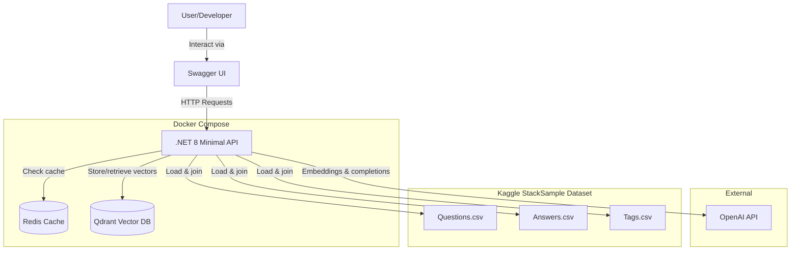
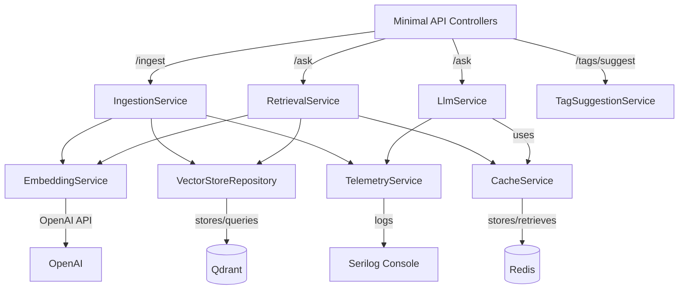
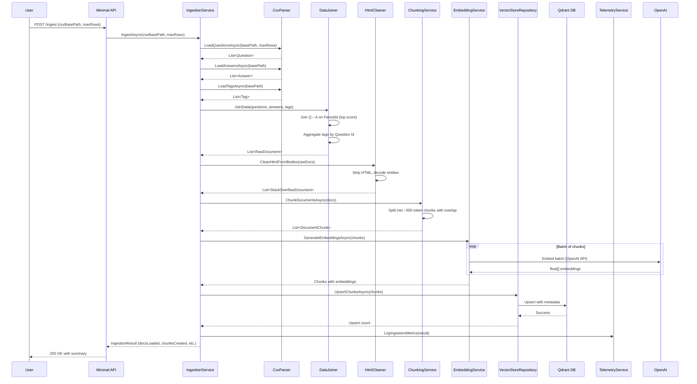
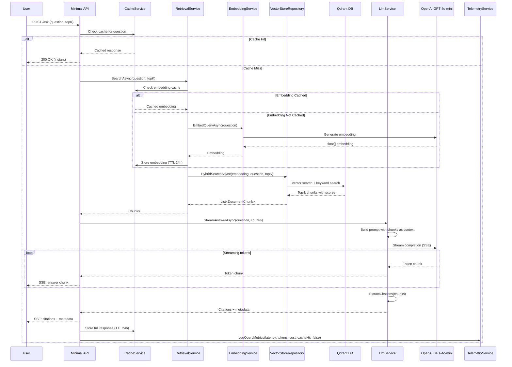

# Stack Overflow RAG Assistant - Architecture Document

## Introduction

This document outlines the architecture for the Stack Overflow RAG Assistant, a learning-focused project demonstrating RAG (Retrieval Augmented Generation) fundamentals in .NET 8. The system answers technical questions with cited Stack Overflow sources and suggests relevant tags using multi-label classification.

**Architecture Philosophy:** Optimize for learning and rapid iteration. Use proven, simple technologies. Favor local execution and measurability over production scalability.

### Technical Summary

The Stack Overflow RAG Assistant is built as a .NET 8 minimal API monolith deployed via Docker Compose. The architecture consists of three core workflows: (1) data ingestion pipeline that chunks Stack Overflow posts and generates embeddings stored in Qdrant vector database, (2) hybrid RAG query pipeline that combines keyword and vector search to retrieve relevant chunks and streams LLM responses with citations via Semantic Kernel, and (3) ML.NET-based tag suggestion using TF-IDF and logistic regression. Redis provides caching for embeddings and responses. The system exposes a REST API documented with Swagger, eliminating the need for a custom UI. All services orchestrate via Docker Compose for one-command local deployment.

### Starter Template or Existing Project

**N/A - Greenfield project**

This is a greenfield .NET 8 minimal API project. No starter templates used to maximize learning transparency.

### Change Log

| Date | Version | Description | Author |
|------|---------|-------------|--------|
| 2025-11-08 | 1.0 | Initial architecture | Winston (Architect Agent) |

---

## High Level Architecture

### Platform and Infrastructure Choice

**Platform:** Local Docker Compose (development/learning environment)

**Key Services:**
- .NET 8 Minimal API (orchestration and API layer)
- Qdrant (vector database for embeddings)
- Redis (caching layer for queries and responses)
- OpenAI API (embeddings and LLM completions)

**Deployment Host:** Local development machines (Windows/Linux/macOS via Docker Desktop)

**Rationale:** Docker Compose provides reproducible, one-command deployment without cloud costs or complexity. All services run locally for fast iteration and complete observability.

### Repository Structure

**Structure:** Monorepo (single Git repository)

**Solution Organization:** Single .NET solution with multiple projects for logical separation

**Package Organization:**
- `StackOverflowRAG.Api` - Minimal API endpoints and Swagger configuration
- `StackOverflowRAG.Core` - Business logic and service implementations
- `StackOverflowRAG.Data` - Data models, CSV ingestion, Qdrant integration
- `StackOverflowRAG.ML` - ML.NET tag suggestion (TF-IDF + logistic regression)
- `StackOverflowRAG.Tests` - Unit and integration tests

**Rationale:** Monorepo with logical project separation balances simplicity with maintainability. No need for complex monorepo tooling (Nx, Turborepo) - standard .NET solution structure suffices.

### High Level Architecture Diagram



### Architectural Patterns

- **Monolithic API with Service Layer:** Single deployable unit with dependency injection, clear service boundaries - _Rationale:_ Simplicity for learning; easy to understand data flow; fast local development
- **Repository Pattern:** Abstract Qdrant vector store operations behind interface - _Rationale:_ Enables testing with mocks; future flexibility to swap vector stores
- **Cache-Aside Pattern:** Check Redis cache before expensive operations (embedding generation, LLM calls) - _Rationale:_ Dramatically reduces latency and API costs for repeated queries
- **Streaming Responses:** Use Server-Sent Events (SSE) via Semantic Kernel for LLM responses - _Rationale:_ Better UX even for local models; demonstrates production pattern
- **Pipeline Pattern:** Ingestion flows through sequential stages (load → clean → chunk → embed → store) - _Rationale:_ Clear separation of concerns; easy to test each stage independently

---

## Tech Stack

### Technology Stack Table

| Category | Technology | Version | Purpose | Rationale |
|----------|-----------|---------|---------|-----------|
| Backend Language | C# | 12 (.NET 8) | Primary development language | Modern C# features, excellent LLM library support, learning goal alignment |
| Backend Framework | ASP.NET Core Minimal API | .NET 8 | API endpoints and HTTP server | Fast startup, minimal boilerplate, ideal for focused API learning |
| API Documentation | Swashbuckle (Swagger/OpenAPI) | 6.5+ | Auto-generated API docs and testing UI | Zero-effort functional UI for testing endpoints |
| LLM Integration | Semantic Kernel | 1.0+ | LLM orchestration, streaming, prompts | Official Microsoft library, demonstrates .NET LLM patterns, abstracts OpenAI/Ollama differences |
| Embedding Model | OpenAI text-embedding-3-small | API | Generate 1536-dim embeddings for chunks and queries | Fast, high quality, cheap ($0.02/1M tokens), simple integration |
| LLM Model | OpenAI GPT-4o-mini | API | Generate answers from retrieved context | Fast, cost-effective ($0.15/1M input, $0.60/1M output), good quality for learning |
| Vector Database | Qdrant | 1.7+ | Store and search embeddings with hybrid search | Simple Docker deployment, official .NET client, built-in hybrid search (dense + sparse) |
| Cache | Redis | 7.2+ | TTL-based caching for embeddings and responses | Industry standard, simple integration, dramatic latency improvement |
| ML Framework | ML.NET | 3.0+ | TF-IDF feature extraction and logistic regression | Pure .NET, no microservice complexity, learning opportunity for ML.NET |
| Data Format | CSV (3 files) | - | Stack Overflow dataset (Kaggle StackSample: Questions.csv, Answers.csv, Tags.csv) | Dataset provided format, requires joining |
| Testing Framework | xUnit | 2.6+ | Unit and integration tests | .NET standard, good async support |
| Mocking | Moq | 4.20+ | Mock dependencies for unit tests | Simple, fluent API |
| HTTP Client Testing | WireMock.NET | 1.5+ | Mock OpenAI API for integration tests | Avoid costs and flakiness in tests |
| Containerization | Docker & Docker Compose | 24+ | Orchestrate API, Qdrant, Redis | One-command deployment, reproducible environment |
| Logging | Serilog | 3.1+ | Structured JSON logging with telemetry | Structured logs for metrics (latency, tokens, cost) |
| Configuration | .NET Options Pattern | .NET 8 | Environment-based configuration | Type-safe config, easy to test, standard .NET pattern |
| HTTP Client | HttpClient via IHttpClientFactory | .NET 8 | Resilient HTTP calls to OpenAI | Proper connection pooling, retry policies |

**Notes:**
- No frontend framework needed - Swagger UI provides functional testing interface
- No separate CI/CD for MVP - manual Docker Compose deployment
- No monitoring platform for MVP - console logs with Serilog suffice
- No IaC needed - Docker Compose YAML is the infrastructure definition

---

## Data Models

### StackOverflowDocument

**Purpose:** Represents a parsed Stack Overflow question/answer pair from the CSV dataset before chunking.

**Key Attributes:**
- `PostId`: string - Stack Overflow post ID (unique identifier from Questions.csv)
- `QuestionTitle`: string - Title of the question
- `QuestionBody`: string - Full markdown body of the question
- `AnswerBody`: string - Full markdown body of the accepted/top answer
- `Tags`: string[] - Array of Stack Overflow tags (e.g., ["c#", ".net", "async"])

**Source Data Structure:**

The Kaggle StackSample dataset consists of three CSV files that must be joined:

**Questions.csv:**
- `Id` - Question identifier (primary key)
- `Title` - Question title
- `Body` - Question HTML body
- `Score` - Vote score
- `CreationDate` - Post timestamp
- `OwnerUserId` - User identifier
- `ClosedDate` - Closure timestamp (nullable)

**Answers.csv:**
- `Id` - Answer identifier (primary key)
- `ParentId` - Foreign key to Questions.Id
- `Body` - Answer HTML body
- `Score` - Vote score
- `CreationDate` - Post timestamp
- `OwnerUserId` - User identifier

**Tags.csv:**
- `Id` - Foreign key to Questions.Id
- `Tag` - Tag name (one row per tag, many-to-many relationship)

**Join Logic:**
1. Load Questions.csv
2. Join with Answers.csv on `Questions.Id = Answers.ParentId` (top-scoring answer per question)
3. Aggregate Tags.csv by `Id` to create tag arrays
4. Clean HTML from Body fields
5. Map to StackOverflowDocument model

**TypeScript Interface (for reference):**
```typescript
interface StackOverflowDocument {
  postId: string;
  questionTitle: string;
  questionBody: string;
  answerBody: string;
  tags: string[];
}
```

**Relationships:**
- One document → Many chunks (after chunking pipeline)

---

### DocumentChunk

**Purpose:** Represents a ~500 token chunk of a Stack Overflow document with metadata for retrieval.

**Key Attributes:**
- `ChunkId`: string - Unique identifier (e.g., `{PostId}_chunk_{index}`)
- `PostId`: string - Source document post ID
- `QuestionTitle`: string - Preserved for citation
- `ChunkText`: string - The actual text content (~500 tokens)
- `ChunkIndex`: int - Ordinal position in source document
- `Embedding`: float[] - 1536-dimensional embedding vector (from OpenAI)

**TypeScript Interface:**
```typescript
interface DocumentChunk {
  chunkId: string;
  postId: string;
  questionTitle: string;
  chunkText: string;
  chunkIndex: number;
  embedding: number[]; // 1536 dimensions
}
```

**Relationships:**
- Many chunks → One source document (via PostId)
- Stored in Qdrant with metadata for hybrid search

---

### QueryRequest

**Purpose:** User input for the `/ask` endpoint.

**Key Attributes:**
- `Question`: string - Natural language question

**TypeScript Interface:**
```typescript
interface QueryRequest {
  question: string;
}
```

---

### QueryResponse

**Purpose:** Streaming response from the `/ask` endpoint with citations.

**Key Attributes:**
- `Answer`: string - LLM-generated answer (streamed)
- `Citations`: Citation[] - List of source Stack Overflow posts
- `Metadata`: QueryMetadata - Performance and cost metrics

**TypeScript Interface:**
```typescript
interface QueryResponse {
  answer: string; // Streamed via SSE
  citations: Citation[];
  metadata: QueryMetadata;
}

interface Citation {
  postId: string;
  title: string;
  url: string; // https://stackoverflow.com/questions/{postId}
  relevanceScore: number;
}

interface QueryMetadata {
  latencyMs: number;
  tokensUsed: number;
  estimatedCost: number;
  cacheHit: boolean;
  retrievedChunks: number;
}
```

---

### TagSuggestionRequest

**Purpose:** Input for the `/tags/suggest` endpoint.

**Key Attributes:**
- `Title`: string - Question title
- `Body`: string - Question body

**TypeScript Interface:**
```typescript
interface TagSuggestionRequest {
  title: string;
  body: string;
}
```

---

### TagSuggestionResponse

**Purpose:** Multi-label tag predictions.

**Key Attributes:**
- `Tags`: string[] - Top 3-5 predicted tags
- `Confidence`: float[] - Confidence scores (0-1) for each tag

**TypeScript Interface:**
```typescript
interface TagSuggestionResponse {
  tags: string[];
  confidence: number[];
}
```

---

## API Specification

### REST API Specification

```yaml
openapi: 3.0.0
info:
  title: Stack Overflow RAG Assistant API
  version: 1.0.0
  description: Learning-focused RAG system for answering technical questions with Stack Overflow citations
servers:
  - url: http://localhost:5000
    description: Local development server

paths:
  /health:
    get:
      summary: Health check endpoint
      operationId: healthCheck
      responses:
        '200':
          description: API is healthy
          content:
            application/json:
              schema:
                type: object
                properties:
                  status:
                    type: string
                    example: "healthy"
                  timestamp:
                    type: string
                    format: date-time

  /ingest:
    post:
      summary: Ingest Stack Overflow CSV data
      operationId: ingestData
      requestBody:
        description: Optional CSV directory path (defaults to config value)
        content:
          application/json:
            schema:
              type: object
              properties:
                csvBasePath:
                  type: string
                  description: Path to directory containing Questions.csv, Answers.csv, Tags.csv (optional)
                  example: "C:\\Users\\Nicky\\Documents\\kaggle\\stacksample"
                maxRows:
                  type: integer
                  description: Max rows to ingest from Questions.csv (optional, default from config)
                  example: 10000
      responses:
        '200':
          description: Ingestion completed successfully
          content:
            application/json:
              schema:
                type: object
                properties:
                  documentsLoaded:
                    type: integer
                    example: 10000
                  chunksCreated:
                    type: integer
                    example: 45000
                  embeddingsGenerated:
                    type: integer
                    example: 45000
                  qdrantUpserts:
                    type: integer
                    example: 45000
                  durationSeconds:
                    type: number
                    example: 127.5
                  errors:
                    type: integer
                    example: 0
        '400':
          description: Invalid request (CSV not found, etc.)
        '500':
          description: Ingestion failed

  /ask:
    post:
      summary: Ask a technical question and get streaming answer with citations
      operationId: askQuestion
      requestBody:
        required: true
        content:
          application/json:
            schema:
              type: object
              required:
                - question
              properties:
                question:
                  type: string
                  description: Natural language question
                  example: "How do I use async/await in C#?"
                topK:
                  type: integer
                  description: Number of chunks to retrieve (optional, default 10)
                  example: 10
      responses:
        '200':
          description: Streaming answer with citations (SSE)
          content:
            text/event-stream:
              schema:
                type: object
                properties:
                  answer:
                    type: string
                    description: LLM-generated answer (streamed)
                  citations:
                    type: array
                    items:
                      type: object
                      properties:
                        postId:
                          type: string
                          example: "123456"
                        title:
                          type: string
                          example: "How to use async/await properly"
                        url:
                          type: string
                          example: "https://stackoverflow.com/questions/123456"
                        relevanceScore:
                          type: number
                          example: 0.87
                  metadata:
                    type: object
                    properties:
                      latencyMs:
                        type: number
                        example: 1834
                      tokensUsed:
                        type: integer
                        example: 2500
                      estimatedCost:
                        type: number
                        example: 0.0015
                      cacheHit:
                        type: boolean
                        example: false
                      retrievedChunks:
                        type: integer
                        example: 10
        '400':
          description: Invalid request (empty question, etc.)
        '500':
          description: Query processing failed

  /tags/suggest:
    post:
      summary: Suggest Stack Overflow tags for a question
      operationId: suggestTags
      requestBody:
        required: true
        content:
          application/json:
            schema:
              type: object
              required:
                - title
                - body
              properties:
                title:
                  type: string
                  description: Question title
                  example: "How to implement async/await pattern"
                body:
                  type: string
                  description: Question body
                  example: "I'm trying to understand how to properly use async/await in C# for database calls..."
      responses:
        '200':
          description: Tag suggestions with confidence scores
          content:
            application/json:
              schema:
                type: object
                properties:
                  tags:
                    type: array
                    items:
                      type: string
                    example: ["c#", "async-await", ".net", "task", "async"]
                  confidence:
                    type: array
                    items:
                      type: number
                    example: [0.89, 0.76, 0.68, 0.54, 0.48]
        '400':
          description: Invalid request
        '500':
          description: Tag suggestion failed
```

---

## Components

### IngestionService

**Responsibility:** Orchestrates the data ingestion pipeline from CSV → Qdrant. Loads three Stack Overflow CSV files (Questions, Answers, Tags), joins and transforms data, cleans HTML, chunks documents, generates embeddings, and upserts to vector store.

**Key Interfaces:**
- `Task<IngestionResult> IngestAsync(string csvBasePath, int maxRows, CancellationToken ct)`
- `Task<List<StackOverflowDocument>> LoadAndJoinCsvsAsync(string basePath, int maxRows)`
- `Task<List<DocumentChunk>> ChunkDocumentsAsync(List<StackOverflowDocument> docs)`

**CSV Loading and Joining:**
- Expects `csvBasePath` to be a directory containing: `Questions.csv`, `Answers.csv`, `Tags.csv`
- Joins Questions ← Answers (on Questions.Id = Answers.ParentId, selecting top-scoring answer)
- Aggregates Tags by Question Id into string arrays
- Cleans HTML from Body fields using HtmlAgilityPack
- Returns `List<StackOverflowDocument>` with joined data

**Dependencies:**
- `ICsvParser` - Parses CSV files using CsvHelper
- `IDataJoiner` - Joins Questions/Answers/Tags into StackOverflowDocument
- `IHtmlCleaner` - Strips HTML tags and decodes entities
- `IChunkingService` - Chunks documents into ~500 token segments
- `IEmbeddingService` - Generates embeddings via OpenAI
- `IVectorStoreRepository` - Upserts chunks to Qdrant
- `ITelemetryService` - Logs ingestion metrics

**Technology Stack:** .NET 8, CsvHelper library, HtmlAgilityPack, Semantic Kernel (embeddings)

---

### RetrievalService

**Responsibility:** Handles hybrid search (keyword + vector) to retrieve relevant chunks for a user query.

**Key Interfaces:**
- `Task<List<DocumentChunk>> SearchAsync(string query, int topK, CancellationToken ct)`
- `Task<List<DocumentChunk>> HybridSearchAsync(float[] queryEmbedding, string queryText, int topK)`

**Dependencies:**
- `IEmbeddingService` - Embeds user query
- `IVectorStoreRepository` - Performs vector + keyword search in Qdrant
- `ICacheService` - Caches query embeddings

**Technology Stack:** .NET 8, Qdrant .NET client

---

### LlmService

**Responsibility:** Manages LLM API calls for generating answers with citations. Constructs prompts from retrieved chunks, streams responses, and formats citations.

**Key Interfaces:**
- `IAsyncEnumerable<string> StreamAnswerAsync(string question, List<DocumentChunk> context, CancellationToken ct)`
- `Task<List<Citation>> ExtractCitationsAsync(List<DocumentChunk> chunks)`

**Dependencies:**
- `Kernel` (Semantic Kernel) - LLM orchestration
- `IPromptBuilder` - Constructs system and user prompts
- `ITelemetryService` - Logs token usage and cost

**Technology Stack:** Semantic Kernel, OpenAI GPT-4o-mini

---

### TagSuggestionService

**Responsibility:** Predicts Stack Overflow tags using TF-IDF + logistic regression multi-label classifier.

**Key Interfaces:**
- `Task<TagSuggestionResult> SuggestTagsAsync(string title, string body, CancellationToken ct)`
- `Task TrainModelAsync(List<StackOverflowDocument> trainingData)` (one-time training)

**Dependencies:**
- `ITfidfVectorizer` (ML.NET) - Extracts TF-IDF features
- `IMultiLabelClassifier` (ML.NET) - Logistic regression model
- Model stored as serialized .zip file, loaded at startup

**Technology Stack:** ML.NET, trained on StackSample dataset

---

### TelemetryService

**Responsibility:** Centralized logging and metrics collection for latency, token usage, cost estimation, and cache performance.

**Key Interfaces:**
- `void LogQueryMetrics(QueryMetadata metadata)`
- `void LogIngestionMetrics(IngestionResult result)`
- `double EstimateCost(int inputTokens, int outputTokens)`

**Dependencies:**
- `ILogger<TelemetryService>` (Serilog) - Structured logging

**Technology Stack:** Serilog with JSON console sink

---

### CacheService

**Responsibility:** Redis-based caching for query embeddings and LLM responses with configurable TTL.

**Key Interfaces:**
- `Task<T?> GetAsync<T>(string key, CancellationToken ct)`
- `Task SetAsync<T>(string key, T value, TimeSpan ttl, CancellationToken ct)`
- `Task<bool> ExistsAsync(string key)`

**Dependencies:**
- `IConnectionMultiplexer` (StackExchange.Redis) - Redis client

**Technology Stack:** StackExchange.Redis

---

### Component Diagram



---

## Core Workflows

### Workflow 1: Data Ingestion Pipeline



---

### Workflow 2: RAG Query Pipeline (Streaming Answer with Citations)



---

## Project Structure

```plaintext
StackOverflowRAG/
├── src/
│   ├── StackOverflowRAG.Api/                  # Minimal API project
│   │   ├── Controllers/                        # (not used - minimal API uses endpoints)
│   │   ├── Endpoints/                          # Endpoint definitions
│   │   │   ├── HealthEndpoints.cs
│   │   │   ├── IngestionEndpoints.cs
│   │   │   ├── QueryEndpoints.cs
│   │   │   └── TagEndpoints.cs
│   │   ├── Configuration/                      # Options classes for IOptions<T>
│   │   │   ├── OpenAIOptions.cs
│   │   │   ├── QdrantOptions.cs
│   │   │   ├── RedisOptions.cs
│   │   │   └── IngestionOptions.cs
│   │   ├── Program.cs                          # App entry point, DI setup
│   │   ├── appsettings.json
│   │   ├── appsettings.Development.json
│   │   └── StackOverflowRAG.Api.csproj
│   │
│   ├── StackOverflowRAG.Core/                  # Business logic and services
│   │   ├── Services/
│   │   │   ├── IngestionService.cs
│   │   │   ├── RetrievalService.cs
│   │   │   ├── LlmService.cs
│   │   │   ├── TagSuggestionService.cs
│   │   │   ├── TelemetryService.cs
│   │   │   ├── CacheService.cs
│   │   │   ├── EmbeddingService.cs
│   │   │   └── ChunkingService.cs
│   │   ├── Interfaces/                         # Service interfaces for DI
│   │   │   ├── IIngestionService.cs
│   │   │   ├── IRetrievalService.cs
│   │   │   └── (etc.)
│   │   ├── Models/                             # Request/response DTOs
│   │   │   ├── QueryRequest.cs
│   │   │   ├── QueryResponse.cs
│   │   │   ├── TagSuggestionRequest.cs
│   │   │   ├── IngestionResult.cs
│   │   │   └── QueryMetadata.cs
│   │   └── StackOverflowRAG.Core.csproj
│   │
│   ├── StackOverflowRAG.Data/                  # Data access and models
│   │   ├── Models/
│   │   │   ├── StackOverflowDocument.cs
│   │   │   ├── DocumentChunk.cs
│   │   │   └── Citation.cs
│   │   ├── Repositories/
│   │   │   ├── IVectorStoreRepository.cs
│   │   │   └── QdrantVectorStoreRepository.cs  # Qdrant implementation
│   │   ├── Parsers/
│   │   │   ├── ICsvParser.cs
│   │   │   └── StackOverflowCsvParser.cs       # CsvHelper-based parser
│   │   └── StackOverflowRAG.Data.csproj
│   │
│   ├── StackOverflowRAG.ML/                    # ML.NET tag suggestion
│   │   ├── Models/
│   │   │   ├── TagPrediction.cs
│   │   │   └── TagTrainingData.cs
│   │   ├── Services/
│   │   │   ├── TfidfVectorizer.cs
│   │   │   └── MultiLabelClassifier.cs
│   │   ├── ModelTraining/
│   │   │   └── TagModelTrainer.cs              # One-time training script
│   │   └── StackOverflowRAG.ML.csproj
│   │
│   └── StackOverflowRAG.Tests/                 # Unit and integration tests
│       ├── Unit/
│       │   ├── ChunkingServiceTests.cs
│       │   ├── CacheServiceTests.cs
│       │   └── (etc.)
│       ├── Integration/
│       │   ├── QdrantIntegrationTests.cs
│       │   ├── OpenAIIntegrationTests.cs       # Uses WireMock.NET
│       │   └── EndToEndQueryTests.cs
│       ├── TestData/
│       │   ├── sample-stackoverflow.csv
│       │   └── golden-test-set.json            # 10-20 question/answer pairs
│       └── StackOverflowRAG.Tests.csproj
│
├── docker-compose.yml                          # Orchestrates API, Qdrant, Redis
├── Dockerfile                                  # .NET 8 API container
├── .env.example                                # Environment variable template
├── README.md                                   # Setup and usage instructions
└── StackOverflowRAG.sln                        # Solution file

# Data files (external, not in repo):
# C:\Users\Nicky\Documents\kaggle\stacksample\
#   ├── Questions.csv                            # Kaggle StackSample Questions
#   ├── Answers.csv                              # Kaggle StackSample Answers
#   └── Tags.csv                                 # Kaggle StackSample Tags
```

---

## Development Workflow

### Local Development Setup

#### Prerequisites

```bash
# Required software
dotnet --version          # .NET 8 SDK (8.0.100+)
docker --version          # Docker 24+
docker compose version    # Docker Compose 2.0+
```

#### Initial Setup

```bash
# 1. Clone repository
git clone <repo-url>
cd StackOverflowRAG

# 2. Copy environment template
cp .env.example .env

# 3. Edit .env with your OpenAI API key
# OPENAI_API_KEY=sk-...
# OPENAI_EMBEDDING_MODEL=text-embedding-3-small
# OPENAI_COMPLETION_MODEL=gpt-4o-mini

# 4. Download Kaggle StackSample dataset
# Ensure three CSV files exist: Questions.csv, Answers.csv, Tags.csv
# Default location: C:\Users\Nicky\Documents\kaggle\stacksample\

# 5. Restore dependencies
dotnet restore

# 6. Build solution
dotnet build

# 7. Start infrastructure (Qdrant + Redis)
docker compose up -d qdrant redis

# 8. Run API locally
dotnet run --project src/StackOverflowRAG.Api

# API will be available at http://localhost:5000
# Swagger UI at http://localhost:5000/swagger
```

#### Development Commands

```bash
# Start all services (API + Qdrant + Redis)
docker compose up

# Start infrastructure only (develop API outside Docker)
docker compose up -d qdrant redis
dotnet run --project src/StackOverflowRAG.Api

# Run tests
dotnet test

# Run specific test project
dotnet test src/StackOverflowRAG.Tests

# Watch mode for tests (re-run on changes)
dotnet watch test --project src/StackOverflowRAG.Tests

# Clean build
dotnet clean && dotnet build

# Stop all Docker services
docker compose down
```

### Environment Configuration

#### Required Environment Variables

```bash
# .env file (root directory)

# OpenAI Configuration
OPENAI_API_KEY=sk-proj-xxxxxxxxxxxxx              # Required: Your OpenAI API key
OPENAI_EMBEDDING_MODEL=text-embedding-3-small     # Embedding model
OPENAI_COMPLETION_MODEL=gpt-4o-mini               # LLM model for answers

# Qdrant Configuration
QDRANT_HOST=http://localhost:6333                 # Qdrant endpoint
QDRANT_COLLECTION_NAME=stackoverflow_chunks       # Collection name

# Redis Configuration
REDIS_CONNECTION_STRING=localhost:6379            # Redis endpoint
REDIS_CACHE_TTL_HOURS=24                          # Cache expiration (hours)

# Ingestion Configuration
CSV_BASE_PATH=C:\Users\Nicky\Documents\kaggle\stacksample  # Directory containing Questions.csv, Answers.csv, Tags.csv
MAX_ROWS=10000                                    # Max rows to ingest from Questions.csv
CHUNK_SIZE=500                                    # Target tokens per chunk
CHUNK_OVERLAP=50                                  # Overlap tokens between chunks

# Retrieval Configuration
DEFAULT_TOP_K=10                                  # Default chunks to retrieve

# Logging
LOG_LEVEL=Information                             # Serilog log level
```

---

## Deployment Architecture

### Deployment Strategy

**Docker Compose Deployment (MVP)**

The entire system deploys via `docker compose up` for local development and learning. This approach prioritizes simplicity and reproducibility over production scalability.

**Services:**
- `api` - .NET 8 minimal API (built from Dockerfile)
- `qdrant` - Qdrant vector database (official image)
- `redis` - Redis cache (official image)

**Deployment Steps:**
1. Build API Docker image: `docker compose build`
2. Start all services: `docker compose up -d`
3. Run ingestion: `curl -X POST http://localhost:5000/ingest`
4. Access Swagger UI: `http://localhost:5000/swagger`

**Build Commands:**
- API: `dotnet publish -c Release -o ./publish`
- Docker image: `docker build -t stackoverflow-rag-api .`

**Output Directory:** `./publish` (copied to Docker image)

---

### Docker Compose Configuration

```yaml
version: '3.8'

services:
  api:
    build:
      context: .
      dockerfile: Dockerfile
    ports:
      - "5000:8080"
    environment:
      - ASPNETCORE_ENVIRONMENT=Development
      - OPENAI_API_KEY=${OPENAI_API_KEY}
      - OPENAI_EMBEDDING_MODEL=${OPENAI_EMBEDDING_MODEL}
      - OPENAI_COMPLETION_MODEL=${OPENAI_COMPLETION_MODEL}
      - QDRANT_HOST=http://qdrant:6333
      - REDIS_CONNECTION_STRING=redis:6379
      - CSV_PATH=/data/stacksample.csv
    volumes:
      - ./data:/data:ro                        # Mount CSV data
    depends_on:
      - qdrant
      - redis
    networks:
      - stackoverflow-rag

  qdrant:
    image: qdrant/qdrant:v1.7.4
    ports:
      - "6333:6333"                            # HTTP API
      - "6334:6334"                            # gRPC (optional)
    volumes:
      - qdrant_storage:/qdrant/storage         # Persist vectors
    networks:
      - stackoverflow-rag

  redis:
    image: redis:7.2-alpine
    ports:
      - "6379:6379"
    volumes:
      - redis_data:/data                       # Persist cache
    networks:
      - stackoverflow-rag

volumes:
  qdrant_storage:
  redis_data:

networks:
  stackoverflow-rag:
    driver: bridge
```

---

### Environments

| Environment | API URL | Qdrant URL | Redis | Purpose |
|-------------|---------|------------|-------|---------|
| Local Dev | http://localhost:5000 | http://localhost:6333 | localhost:6379 | Local development and testing |
| Docker Compose | http://localhost:5000 | http://qdrant:6333 (internal) | redis:6379 (internal) | Containerized local deployment |

**Note:** No staging/production environments for MVP. This is a learning project optimized for local execution.

---

## Testing Strategy

### Testing Pyramid

```
        E2E/Integration Tests (Golden Set Validation)
        /                                             \
    Integration Tests (Qdrant, Redis, OpenAI mocks)
    /                                                 \
Unit Tests (Services, chunking, caching, parsing)
```

### Test Organization

**Unit Tests (Majority):**
- `ChunkingServiceTests` - Verify chunk size, overlap, metadata preservation
- `CacheServiceTests` - Verify TTL, key generation, hit/miss logic
- `TelemetryServiceTests` - Verify cost calculation, metric logging
- `CsvParserTests` - Verify parsing, validation, HTML cleaning
- `PromptBuilderTests` - Verify prompt construction from chunks

**Integration Tests (Critical Paths):**
- `QdrantIntegrationTests` - Upsert, vector search, hybrid search (requires Docker)
- `RedisIntegrationTests` - Cache operations (requires Docker)
- `OpenAIIntegrationTests` - Mock OpenAI with WireMock.NET for embedding/completion
- `EndToEndQueryTests` - Full `/ask` pipeline with mocks

**Golden Test Set Validation (Manual + Automated):**
- 10-20 curated question/answer pairs from StackSample
- Automated script validates Hit@5 metric (is correct answer in top 5 chunks?)
- Target: Hit@5 ≥ 0.7
- Manual review of answer quality and citation relevance

### Test Examples

#### Unit Test Example: ChunkingService

```csharp
public class ChunkingServiceTests
{
    [Fact]
    public async Task ChunkDocumentsAsync_ShouldCreateChunksWithinTokenLimit()
    {
        // Arrange
        var service = new ChunkingService(chunkSize: 500, overlap: 50);
        var doc = new StackOverflowDocument
        {
            PostId = "12345",
            QuestionTitle = "Test Question",
            QuestionBody = GenerateLongText(2000), // 2000 tokens
            AnswerBody = GenerateLongText(1500),   // 1500 tokens
            Tags = new[] { "c#", "async" }
        };

        // Act
        var chunks = await service.ChunkDocumentsAsync(new[] { doc });

        // Assert
        Assert.True(chunks.Count > 1); // Should create multiple chunks
        foreach (var chunk in chunks)
        {
            var tokenCount = CountTokens(chunk.ChunkText);
            Assert.InRange(tokenCount, 400, 550); // ~500 +/- tolerance
            Assert.Equal("12345", chunk.PostId);
            Assert.Equal("Test Question", chunk.QuestionTitle);
        }
    }
}
```

#### Integration Test Example: Qdrant

```csharp
public class QdrantIntegrationTests : IAsyncLifetime
{
    private QdrantClient _client;
    private QdrantVectorStoreRepository _repo;

    public async Task InitializeAsync()
    {
        _client = new QdrantClient("http://localhost:6333");
        _repo = new QdrantVectorStoreRepository(_client, "test_collection");
        await _repo.CreateCollectionAsync(vectorSize: 1536);
    }

    [Fact]
    public async Task UpsertAndSearch_ShouldRetrieveRelevantChunks()
    {
        // Arrange
        var chunks = new[]
        {
            new DocumentChunk
            {
                ChunkId = "1",
                PostId = "123",
                QuestionTitle = "Async in C#",
                ChunkText = "Use async/await for asynchronous operations...",
                Embedding = GenerateRandomEmbedding(1536)
            }
        };

        // Act
        await _repo.UpsertChunksAsync(chunks);
        var results = await _repo.SearchAsync(
            queryEmbedding: GenerateRandomEmbedding(1536),
            topK: 5
        );

        // Assert
        Assert.NotEmpty(results);
        Assert.Contains(results, c => c.ChunkId == "1");
    }

    public async Task DisposeAsync()
    {
        await _repo.DeleteCollectionAsync();
    }
}
```

---

## Coding Standards

### Critical Rules for AI Agents

- **Dependency Injection:** Always use constructor injection for services. Never instantiate services with `new` in controllers/endpoints.
- **Async All The Way:** All service methods must be async (`Task<T>` or `IAsyncEnumerable<T>`). Never block with `.Result` or `.Wait()`.
- **Configuration via Options Pattern:** Access configuration through `IOptions<T>`. Never read `IConfiguration` or `Environment.GetEnvironmentVariable` directly in services.
- **Exception Handling:** Use try-catch in endpoint handlers, return appropriate HTTP status codes (400, 500). Log exceptions via `ILogger`.
- **Cancellation Tokens:** All async methods must accept `CancellationToken` and pass it through async call chains.
- **Dispose Pattern:** Use `using` statements or `IAsyncDisposable` for `HttpClient`, `Stream`, and database connections.
- **Structured Logging:** Use Serilog with structured parameters: `_logger.LogInformation("Query processed in {LatencyMs}ms", latency)`.

### Naming Conventions

| Element | Convention | Example |
|---------|-----------|---------|
| Services | PascalCase with "Service" suffix | `IngestionService` |
| Interfaces | PascalCase with "I" prefix | `IRetrievalService` |
| DTOs/Models | PascalCase | `QueryRequest`, `DocumentChunk` |
| Private fields | camelCase with `_` prefix | `_logger`, `_cache` |
| Constants | PascalCase | `DefaultChunkSize` |
| Endpoints | Lowercase with hyphens | `/ingest`, `/ask`, `/tags/suggest` |

---

## Error Handling Strategy

### Error Response Format

```csharp
public class ApiErrorResponse
{
    public ApiError Error { get; set; }
}

public class ApiError
{
    public string Code { get; set; }          // e.g., "INVALID_REQUEST", "OPENAI_ERROR"
    public string Message { get; set; }       // User-friendly message
    public Dictionary<string, object>? Details { get; set; } // Optional extra context
    public DateTime Timestamp { get; set; }
    public string RequestId { get; set; }     // For correlation
}
```

### Error Handling Pattern (Endpoints)

```csharp
app.MapPost("/ask", async (
    QueryRequest request,
    IRetrievalService retrieval,
    ILlmService llm,
    ILogger<Program> logger,
    CancellationToken ct) =>
{
    try
    {
        if (string.IsNullOrWhiteSpace(request.Question))
        {
            return Results.BadRequest(new ApiErrorResponse
            {
                Error = new ApiError
                {
                    Code = "INVALID_REQUEST",
                    Message = "Question cannot be empty",
                    Timestamp = DateTime.UtcNow,
                    RequestId = Guid.NewGuid().ToString()
                }
            });
        }

        var chunks = await retrieval.SearchAsync(request.Question, 10, ct);
        var answerStream = llm.StreamAnswerAsync(request.Question, chunks, ct);

        return Results.Stream(answerStream, "text/event-stream");
    }
    catch (OpenAIException ex)
    {
        logger.LogError(ex, "OpenAI API error during query processing");
        return Results.Problem(
            statusCode: 500,
            title: "LLM Service Error",
            detail: "Failed to generate answer. Please try again."
        );
    }
    catch (Exception ex)
    {
        logger.LogError(ex, "Unexpected error during query processing");
        return Results.Problem(
            statusCode: 500,
            title: "Internal Server Error",
            detail: "An unexpected error occurred."
        );
    }
});
```

---

## Monitoring and Observability

### Monitoring Stack (MVP)

- **Logging:** Serilog with JSON console output (structured logs)
- **Metrics Collection:** Custom `TelemetryService` logs to console
- **Error Tracking:** Console logs (no external service for MVP)
- **Performance Monitoring:** Manual log analysis for latency/cost trends

### Key Metrics Logged

**Per-Query Metrics (via TelemetryService):**
```json
{
  "timestamp": "2025-11-08T10:30:45Z",
  "eventType": "QueryCompleted",
  "question": "How to use async/await in C#?",
  "latencyMs": 1834,
  "tokensInput": 1200,
  "tokensOutput": 350,
  "tokenTotal": 1550,
  "estimatedCost": 0.00039,
  "cacheHit": false,
  "retrievedChunks": 10,
  "topRelevanceScore": 0.87
}
```

**Ingestion Metrics:**
```json
{
  "timestamp": "2025-11-08T09:15:00Z",
  "eventType": "IngestionCompleted",
  "documentsLoaded": 10000,
  "chunksCreated": 45000,
  "embeddingsGenerated": 45000,
  "qdrantUpserts": 45000,
  "durationSeconds": 127.5,
  "errors": 0
}
```

**Future Enhancements (Post-MVP):**
- Export logs to file for offline analysis
- Build simple dashboard (p50/p95 latency, cost trends, cache hit rate)
- Integrate Prometheus/Grafana if scaling beyond local execution

---

## Next Steps

You now have a complete architecture blueprint for the Stack Overflow RAG Assistant. The architecture is optimized for learning with:

✅ **Clear Technology Decisions:** Qdrant, Semantic Kernel, ML.NET, OpenAI, Swagger
✅ **Well-Defined Components:** 6 services with clear responsibilities
✅ **Simple Deployment:** Docker Compose for one-command setup
✅ **Measurable Outcomes:** Golden test set, telemetry, cost tracking
✅ **Learning-Focused:** Transparent patterns, no over-engineering

**Recommended Implementation Order:**

1. **Start with Epic 1, Story 1.1** - Set up the .NET solution and Docker Compose
2. **Follow PRD story sequence** - Each story builds on the previous
3. **Test as you go** - Unit tests for services, integration tests for Qdrant/Redis
4. **Run ingestion early** - Validate the full pipeline with small dataset (1k rows)
5. **Iterate on retrieval quality** - Use golden test set to tune chunk size, top-k

**Key Documentation References:**
- Qdrant .NET SDK: https://github.com/qdrant/qdrant-dotnet
- Semantic Kernel: https://learn.microsoft.com/semantic-kernel
- ML.NET: https://dotnet.microsoft.com/apps/machinelearning-ai/ml-dotnet

Good luck with your RAG learning journey! 🚀
